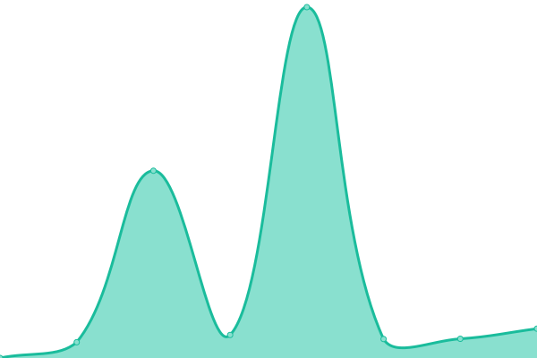

# [📈 Live Status](https://DFE-Digital.github.io/teacher-services-upptime): <!--live status--> **🟩 All systems operational**

This repository contains the open-source uptime monitor and status page for [Department for Education - Digital](http://education.gov.uk/), powered by [Upptime](https://github.com/upptime/upptime).

With [Upptime](https://upptime.js.org), you can get your own unlimited and free uptime monitor and status page, powered entirely by a GitHub repository. We use [Issues](https://github.com/DFE-Digital/teacher-services-upptime/issues) as incident reports, [Actions](https://github.com/DFE-Digital/teacher-services-upptime/actions) as uptime monitors, and [Pages](https://DFE-Digital.github.io/teacher-services-upptime) for the status page.

<!--start: status pages-->
<!-- This summary is generated by Upptime (https://github.com/upptime/upptime) -->
<!-- Do not edit this manually, your changes will be overwritten -->
<!-- prettier-ignore -->
| URL | Status | History | Response Time | Uptime |
| --- | ------ | ------- | ------------- | ------ |
|  [Get into teaching](https://getintoteaching.education.gov.uk/) | 🟩 Up | [get-into-teaching.yml](https://github.com/DFE-Digital/teacher-services-upptime/commits/HEAD/history/get-into-teaching.yml) | 

 688ms
     
 | 

<a href="https://teacher-services-status.education.gov.uk/history/get-into-teaching">100.00%</a>
    

|  [Get into teaching - Adviser](https://adviser-getintoteaching.education.gov.uk/) | 🟩 Up | [get-into-teaching-adviser.yml](https://github.com/DFE-Digital/teacher-services-upptime/commits/HEAD/history/get-into-teaching-adviser.yml) | 

 762ms
     
 | 

<a href="https://teacher-services-status.education.gov.uk/history/get-into-teaching-adviser">100.00%</a>
    

|  [Get into teaching - API](https://get-into-teaching-api-prod.london.cloudapps.digital/api/operations/health_check) | 🟩 Up | [get-into-teaching-api.yml](https://github.com/DFE-Digital/teacher-services-upptime/commits/HEAD/history/get-into-teaching-api.yml) | 

 794ms
     
 | 

<a href="https://teacher-services-status.education.gov.uk/history/get-into-teaching-api">100.00%</a>
    

|  [School Experience](https://schoolexperience.education.gov.uk/healthcheck) | 🟩 Up | [school-experience.yml](https://github.com/DFE-Digital/teacher-services-upptime/commits/HEAD/history/school-experience.yml) | 

 1676ms
     
 | 

<a href="https://teacher-services-status.education.gov.uk/history/school-experience">100.00%</a>
    

|  [Register trainee teachers](https://www.register-trainee-teachers.education.gov.uk/) | 🟩 Up | [register-trainee-teachers.yml](https://github.com/DFE-Digital/teacher-services-upptime/commits/HEAD/history/register-trainee-teachers.yml) | 

 1406ms
     
 | 

<a href="https://teacher-services-status.education.gov.uk/history/register-trainee-teachers">100.00%</a>
    

|  [Find postgraduate teacher training](https://www.find-postgraduate-teacher-training.service.gov.uk/healthcheck) | 🟩 Up | [find-postgraduate-teacher-training.yml](https://github.com/DFE-Digital/teacher-services-upptime/commits/HEAD/history/find-postgraduate-teacher-training.yml) | 

 701ms
     
 | 

<a href="https://teacher-services-status.education.gov.uk/history/find-postgraduate-teacher-training">100.00%</a>
    

|  [Publish teacher training courses](https://www.publish-teacher-training-courses.service.gov.uk/healthcheck) | 🟩 Up | [publish-teacher-training-courses.yml](https://github.com/DFE-Digital/teacher-services-upptime/commits/HEAD/history/publish-teacher-training-courses.yml) | 

 598ms
     
 | 

<a href="https://teacher-services-status.education.gov.uk/history/publish-teacher-training-courses">100.00%</a>
    

|  [Apply for teacher training](https://www.apply-for-teacher-training.service.gov.uk/integrations/monitoring/all) | 🟩 Up | [apply-for-teacher-training.yml](https://github.com/DFE-Digital/teacher-services-upptime/commits/HEAD/history/apply-for-teacher-training.yml) | 

 698ms
     
 | 

<a href="https://teacher-services-status.education.gov.uk/history/apply-for-teacher-training">100.00%</a>
    

|  [Teacher training API](https://api.publish-teacher-training-courses.service.gov.uk/healthcheck) | 🟩 Up | [teacher-training-api.yml](https://github.com/DFE-Digital/teacher-services-upptime/commits/HEAD/history/teacher-training-api.yml) | 

 722ms
     
 | 

<a href="https://teacher-services-status.education.gov.uk/history/teacher-training-api">100.00%</a>
    

|  [Teaching Vacancies](https://teaching-vacancies.service.gov.uk/) | 🟩 Up | [teaching-vacancies.yml](https://github.com/DFE-Digital/teacher-services-upptime/commits/HEAD/history/teaching-vacancies.yml) | 

 997ms
     
 | 

<a href="https://teacher-services-status.education.gov.uk/history/teaching-vacancies">100.00%</a>
    

|  [Manage Teacher CPD](https://manage-training-for-early-career-teachers.education.gov.uk/healthcheck) | 🟩 Up | [manage-teacher-cpd.yml](https://github.com/DFE-Digital/teacher-services-upptime/commits/HEAD/history/manage-teacher-cpd.yml) | 

 967ms
     
 | 

<a href="https://teacher-services-status.education.gov.uk/history/manage-teacher-cpd">100.00%</a>
    

|  [Support Early Career Teachers](https://support-for-early-career-teachers.education.gov.uk/healthcheck) | 🟩 Up | [support-early-career-teachers.yml](https://github.com/DFE-Digital/teacher-services-upptime/commits/HEAD/history/support-early-career-teachers.yml) | 

 811ms
     
 | 

<a href="https://teacher-services-status.education.gov.uk/history/support-early-career-teachers">100.00%</a>
    

|  [Claim Additional Payments for Teachers](https://claim-additional-teaching-payment.service.gov.uk/healthcheck) | 🟩 Up | [claim-additional-payments-for-teachers.yml](https://github.com/DFE-Digital/teacher-services-upptime/commits/HEAD/history/claim-additional-payments-for-teachers.yml) | 

 573ms
     
 | 

<a href="https://teacher-services-status.education.gov.uk/history/claim-additional-payments-for-teachers">100.00%</a>
    

|  [Qualified Teachers API](https://qualified-teachers-api-prod.london.cloudapps.digital/status) | 🟩 Up | [qualified-teachers-api.yml](https://github.com/DFE-Digital/teacher-services-upptime/commits/HEAD/history/qualified-teachers-api.yml) | 

 539ms
     
 | 

<a href="https://teacher-services-status.education.gov.uk/history/qualified-teachers-api">100.00%</a>
    

|  [Find a lost TRN](https://find-a-lost-trn.education.gov.uk/health) | 🟩 Up | [find-a-lost-trn.yml](https://github.com/DFE-Digital/teacher-services-upptime/commits/HEAD/history/find-a-lost-trn.yml) | 

 593ms
     
 | 

<a href="https://teacher-services-status.education.gov.uk/history/find-a-lost-trn">100.00%</a>
    

|  [Apply for QTS](https://apply-for-qts-in-england.education.gov.uk/healthcheck) | 🟩 Up | [apply-for-qts.yml](https://github.com/DFE-Digital/teacher-services-upptime/commits/HEAD/history/apply-for-qts.yml) | 

 1999ms
     
 | 

<a href="https://teacher-services-status.education.gov.uk/history/apply-for-qts">100.00%</a>
    

<!--end: status pages-->

[**Visit our status website →**](https://DFE-Digital.github.io/teacher-services-upptime)

## 📄 License

- Powered by: [Upptime](https://github.com/upptime/upptime)
- Code: [MIT](./LICENSE) © [Department for Education - Digital](http://education.gov.uk/)
- Data in the `./history` directory: [Open Database License](https://opendatacommons.org/licenses/odbl/1-0/)
