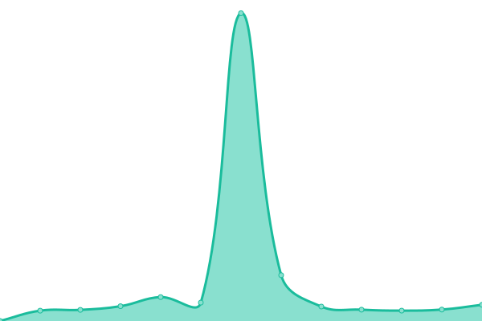

# [📈 Live Status](https://DFE-Digital.github.io/teacher-services-upptime): <!--live status--> **🟩 All systems operational**

This repository contains the open-source uptime monitor and status page for [Department for Education - Digital](http://education.gov.uk/), powered by [Upptime](https://github.com/upptime/upptime).

With [Upptime](https://upptime.js.org), you can get your own unlimited and free uptime monitor and status page, powered entirely by a GitHub repository. We use [Issues](https://github.com/DFE-Digital/teacher-services-upptime/issues) as incident reports, [Actions](https://github.com/DFE-Digital/teacher-services-upptime/actions) as uptime monitors, and [Pages](https://DFE-Digital.github.io/teacher-services-upptime) for the status page.

<!--start: status pages-->
<!-- This summary is generated by Upptime (https://github.com/upptime/upptime) -->
<!-- Do not edit this manually, your changes will be overwritten -->
<!-- prettier-ignore -->
| URL | Status | History | Response Time | Uptime |
| --- | ------ | ------- | ------------- | ------ |
|  [Access your teaching qualifications](https://access-your-teaching-qualifications.education.gov.uk/health/all) | 🟩 Up | [access-your-teaching-qualifications.yml](https://github.com/DFE-Digital/teacher-services-upptime/commits/HEAD/history/access-your-teaching-qualifications.yml) | 

 1497ms
     
 | 

<a href="https://teacher-services-status.education.gov.uk/history/access-your-teaching-qualifications">97.26%</a>
    

|  [Apply for qualified teacher status](https://apply-for-qts-in-england.education.gov.uk/healthcheck) | 🟩 Up | [apply-for-qualified-teacher-status.yml](https://github.com/DFE-Digital/teacher-services-upptime/commits/HEAD/history/apply-for-qualified-teacher-status.yml) | 

 461ms
     
 | 

<a href="https://teacher-services-status.education.gov.uk/history/apply-for-qualified-teacher-status">97.01%</a>
    

|  [Apply for teacher training](https://www.apply-for-teacher-training.service.gov.uk/integrations/monitoring/all) | 🟩 Up | [apply-for-teacher-training.yml](https://github.com/DFE-Digital/teacher-services-upptime/commits/HEAD/history/apply-for-teacher-training.yml) | 

 1015ms
     
 | 

<a href="https://teacher-services-status.education.gov.uk/history/apply-for-teacher-training">96.65%</a>
    

|  [Check a teacher's record](https://check-a-teachers-record.education.gov.uk/health) | 🟩 Up | [check-a-teacher-s-record.yml](https://github.com/DFE-Digital/teacher-services-upptime/commits/HEAD/history/check-a-teacher-s-record.yml) | 

 533ms
     
 | 

<a href="https://teacher-services-status.education.gov.uk/history/check-a-teacher-s-record">97.77%</a>
    

|  [Check the children's barred list](https://check-the-childrens-barred-list.education.gov.uk/healthcheck) | 🟩 Up | [check-the-children-s-barred-list.yml](https://github.com/DFE-Digital/teacher-services-upptime/commits/HEAD/history/check-the-children-s-barred-list.yml) | 

 1165ms
     
 | 

<a href="https://teacher-services-status.education.gov.uk/history/check-the-children-s-barred-list">97.65%</a>
    

|  [Claim Additional Payments for Teachers](https://claim-additional-teaching-payment.service.gov.uk/healthcheck) | 🟩 Up | [claim-additional-payments-for-teachers.yml](https://github.com/DFE-Digital/teacher-services-upptime/commits/HEAD/history/claim-additional-payments-for-teachers.yml) | 

 1840ms
     
 | 

<a href="https://teacher-services-status.education.gov.uk/history/claim-additional-payments-for-teachers">96.27%</a>
    

|  [Claim funding for mentor training](https://claim-funding-for-mentor-training.education.gov.uk/healthcheck/all) | 🟩 Up | [claim-funding-for-mentor-training.yml](https://github.com/DFE-Digital/teacher-services-upptime/commits/HEAD/history/claim-funding-for-mentor-training.yml) | 

 1548ms
     
 | 

<a href="https://teacher-services-status.education.gov.uk/history/claim-funding-for-mentor-training">96.50%</a>
    

|  [Find a lost TRN](https://find-a-lost-trn.education.gov.uk/health) | 🟩 Up | [find-a-lost-trn.yml](https://github.com/DFE-Digital/teacher-services-upptime/commits/HEAD/history/find-a-lost-trn.yml) | 

 505ms
     
 | 

<a href="https://teacher-services-status.education.gov.uk/history/find-a-lost-trn">97.01%</a>
    

|  [Find a Teaching School Hub](https://find-a-teaching-school-hub.education.gov.uk/healthcheck) | 🟩 Up | [find-a-teaching-school-hub.yml](https://github.com/DFE-Digital/teacher-services-upptime/commits/HEAD/history/find-a-teaching-school-hub.yml) | 

 1369ms
     
 | 

<a href="https://teacher-services-status.education.gov.uk/history/find-a-teaching-school-hub">96.93%</a>
    

|  [Find teacher training courses](https://find-teacher-training-courses.service.gov.uk/healthcheck) | 🟩 Up | [find-teacher-training-courses.yml](https://github.com/DFE-Digital/teacher-services-upptime/commits/HEAD/history/find-teacher-training-courses.yml) | 

 2631ms
     
 | 

<a href="https://teacher-services-status.education.gov.uk/history/find-teacher-training-courses">92.68%</a>
    

|  [Find postgraduate teacher training](https://www.find-postgraduate-teacher-training.service.gov.uk/healthcheck) | 🟩 Up | [find-postgraduate-teacher-training.yml](https://github.com/DFE-Digital/teacher-services-upptime/commits/HEAD/history/find-postgraduate-teacher-training.yml) | 

 1001ms
     
 | 

<a href="https://teacher-services-status.education.gov.uk/history/find-postgraduate-teacher-training">96.73%</a>
    

|  [Get a Teacher Relocation Payment](https://get-a-teacher-relocation-payment.education.gov.uk/healthcheck/all) | 🟩 Up | [get-a-teacher-relocation-payment.yml](https://github.com/DFE-Digital/teacher-services-upptime/commits/HEAD/history/get-a-teacher-relocation-payment.yml) | 

 2278ms
     
 | 

<a href="https://teacher-services-status.education.gov.uk/history/get-a-teacher-relocation-payment">96.19%</a>
    

|  [Get into teaching](https://getintoteaching.education.gov.uk/) | 🟩 Up | [get-into-teaching.yml](https://github.com/DFE-Digital/teacher-services-upptime/commits/HEAD/history/get-into-teaching.yml) | 

 1545ms
     
 | 

<a href="https://teacher-services-status.education.gov.uk/history/get-into-teaching">91.97%</a>
    

|  [Get into teaching - API](https://getintoteachingapi-production.teacherservices.cloud/api/operations/health_check) | 🟩 Up | [get-into-teaching-api.yml](https://github.com/DFE-Digital/teacher-services-upptime/commits/HEAD/history/get-into-teaching-api.yml) | 

 667ms
     
 | 

<a href="https://teacher-services-status.education.gov.uk/history/get-into-teaching-api">100.00%</a>
    

|  [Manage Teacher CPD](https://manage-training-for-early-career-teachers.education.gov.uk/healthcheck) | 🟩 Up | [manage-teacher-cpd.yml](https://github.com/DFE-Digital/teacher-services-upptime/commits/HEAD/history/manage-teacher-cpd.yml) | 

 1684ms
     
 | 

<a href="https://teacher-services-status.education.gov.uk/history/manage-teacher-cpd">97.14%</a>
    

|  [Professional development for teachers and leaders](http://professional-development-for-teachers-leaders.education.gov.uk/) | 🟩 Up | [professional-development-for-teachers-and-leaders.yml](https://github.com/DFE-Digital/teacher-services-upptime/commits/HEAD/history/professional-development-for-teachers-and-leaders.yml) | 

 1938ms
     
 | 

<a href="https://teacher-services-status.education.gov.uk/history/professional-development-for-teachers-and-leaders">97.70%</a>
    

|  [Publish teacher training courses](https://www.publish-teacher-training-courses.service.gov.uk/healthcheck) | 🟩 Up | [publish-teacher-training-courses.yml](https://github.com/DFE-Digital/teacher-services-upptime/commits/HEAD/history/publish-teacher-training-courses.yml) | 

 1470ms
     
 | 

<a href="https://teacher-services-status.education.gov.uk/history/publish-teacher-training-courses">97.04%</a>
    

|  [Refer serious misconduct](https://refer-serious-misconduct.education.gov.uk/health/all) | 🟩 Up | [refer-serious-misconduct.yml](https://github.com/DFE-Digital/teacher-services-upptime/commits/HEAD/history/refer-serious-misconduct.yml) | 

 1305ms
     
 | 

<a href="https://teacher-services-status.education.gov.uk/history/refer-serious-misconduct">97.39%</a>
    

|  [Register For a National Professional Qualification](https://register-national-professional-qualifications.education.gov.uk/healthcheck) | 🟩 Up | [register-for-a-national-professional-qualification.yml](https://github.com/DFE-Digital/teacher-services-upptime/commits/HEAD/history/register-for-a-national-professional-qualification.yml) | 

 619ms
     
 | 

<a href="https://teacher-services-status.education.gov.uk/history/register-for-a-national-professional-qualification">96.64%</a>
    

|  [Register of Training Providers](https://register-of-training-providers.education.gov.uk/healthcheck) | 🟩 Up | [register-of-training-providers.yml](https://github.com/DFE-Digital/teacher-services-upptime/commits/HEAD/history/register-of-training-providers.yml) | 

 662ms
     
 | 

<a href="https://teacher-services-status.education.gov.uk/history/register-of-training-providers">97.11%</a>
    

|  [Find Placement Schools](https://find-placement-schools.education.gov.uk/healthcheck) | 🟩 Up | [find-placement-schools.yml](https://github.com/DFE-Digital/teacher-services-upptime/commits/HEAD/history/find-placement-schools.yml) | 

 674ms
     
 | 

<a href="https://teacher-services-status.education.gov.uk/history/find-placement-schools">96.96%</a>
    

|  [Register trainee teachers](https://www.register-trainee-teachers.education.gov.uk/) | 🟩 Up | [register-trainee-teachers.yml](https://github.com/DFE-Digital/teacher-services-upptime/commits/HEAD/history/register-trainee-teachers.yml) | 

 1540ms
     
 | 

<a href="https://teacher-services-status.education.gov.uk/history/register-trainee-teachers">96.59%</a>
    

|  [School Experience](https://schoolexperience.education.gov.uk/healthcheck) | 🟩 Up | [school-experience.yml](https://github.com/DFE-Digital/teacher-services-upptime/commits/HEAD/history/school-experience.yml) | 

 3214ms
     
 | 

<a href="https://teacher-services-status.education.gov.uk/history/school-experience">96.17%</a>
    

|  [Support For Early Career Teachers](https://support-for-early-career-teachers.education.gov.uk/) | 🟩 Up | [support-for-early-career-teachers.yml](https://github.com/DFE-Digital/teacher-services-upptime/commits/HEAD/history/support-for-early-career-teachers.yml) | 

 164ms
     
 | 

<a href="https://teacher-services-status.education.gov.uk/history/support-for-early-career-teachers">100.00%</a>
    

|  [Teaching Identity](https://teaching-identity.education.gov.uk/status) | 🟩 Up | [teaching-identity.yml](https://github.com/DFE-Digital/teacher-services-upptime/commits/HEAD/history/teaching-identity.yml) | 

 1128ms
     
 | 

<a href="https://teacher-services-status.education.gov.uk/history/teaching-identity">96.93%</a>
    

|  [Teaching Record System / Teacher Qualifications API](https://teacher-qualifications-api.education.gov.uk/status) | 🟩 Up | [teaching-record-system-teacher-qualifications-api.yml](https://github.com/DFE-Digital/teacher-services-upptime/commits/HEAD/history/teaching-record-system-teacher-qualifications-api.yml) | 

 1237ms
     
 | 

<a href="https://teacher-services-status.education.gov.uk/history/teaching-record-system-teacher-qualifications-api">97.78%</a>
    

|  [Teacher training API](https://api.publish-teacher-training-courses.service.gov.uk/healthcheck) | 🟩 Up | [teacher-training-api.yml](https://github.com/DFE-Digital/teacher-services-upptime/commits/HEAD/history/teacher-training-api.yml) | 

 585ms
     
 | 

<a href="https://teacher-services-status.education.gov.uk/history/teacher-training-api">91.77%</a>
    

|  [Teaching Vacancies](https://teaching-vacancies.service.gov.uk/) | 🟩 Up | [teaching-vacancies.yml](https://github.com/DFE-Digital/teacher-services-upptime/commits/HEAD/history/teaching-vacancies.yml) | 

 851ms
     
 | 

<a href="https://teacher-services-status.education.gov.uk/history/teaching-vacancies">100.00%</a>
    

<!--end: status pages-->

[**Visit our status website →**](https://DFE-Digital.github.io/teacher-services-upptime)

## 📄 License

- Powered by: [Upptime](https://github.com/upptime/upptime)
- Code: [MIT](./LICENSE) © [Department for Education - Digital](http://education.gov.uk/)
- Data in the `./history` directory: [Open Database License](https://opendatacommons.org/licenses/odbl/1-0/)
