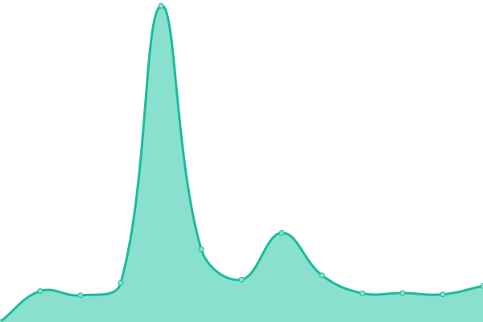
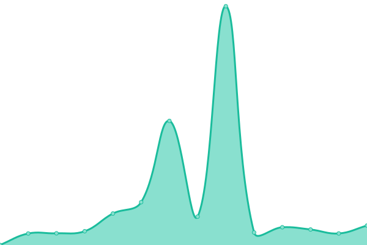
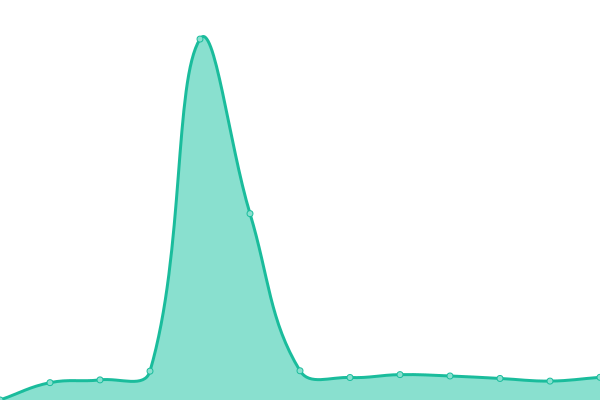

# [📈 Live Status](https://DFE-Digital.github.io/teacher-services-upptime): <!--live status--> **🟧 Partial outage**

This repository contains the open-source uptime monitor and status page for [Department for Education - Digital](http://education.gov.uk/), powered by [Upptime](https://github.com/upptime/upptime).

With [Upptime](https://upptime.js.org), you can get your own unlimited and free uptime monitor and status page, powered entirely by a GitHub repository. We use [Issues](https://github.com/DFE-Digital/teacher-services-upptime/issues) as incident reports, [Actions](https://github.com/DFE-Digital/teacher-services-upptime/actions) as uptime monitors, and [Pages](https://DFE-Digital.github.io/teacher-services-upptime) for the status page.

<!--start: status pages-->
<!-- This summary is generated by Upptime (https://github.com/upptime/upptime) -->
<!-- Do not edit this manually, your changes will be overwritten -->
<!-- prettier-ignore -->
| URL | Status | History | Response Time | Uptime |
| --- | ------ | ------- | ------------- | ------ |
|  [Get into teaching](https://getintoteaching.education.gov.uk/) | 🟩 Up | [get-into-teaching.yml](https://github.com/DFE-Digital/teacher-services-upptime/commits/HEAD/history/get-into-teaching.yml) | 

 812ms
     
 | 

<a href="https://teacher-services-status.education.gov.uk/history/get-into-teaching">100.00%</a>
    

|  [Get into teaching - API](https://getintoteachingapi-production.teacherservices.cloud/api/operations/health_check) | 🟩 Up | [get-into-teaching-api.yml](https://github.com/DFE-Digital/teacher-services-upptime/commits/HEAD/history/get-into-teaching-api.yml) | 

 650ms
     
 | 

<a href="https://teacher-services-status.education.gov.uk/history/get-into-teaching-api">100.00%</a>
    

|  [School Experience](https://schoolexperience.education.gov.uk/healthcheck) | 🟩 Up | [school-experience.yml](https://github.com/DFE-Digital/teacher-services-upptime/commits/HEAD/history/school-experience.yml) | 

 2242ms
     
 | 

<a href="https://teacher-services-status.education.gov.uk/history/school-experience">100.00%</a>
    

|  [Register trainee teachers](https://www.register-trainee-teachers.education.gov.uk/) | 🟩 Up | [register-trainee-teachers.yml](https://github.com/DFE-Digital/teacher-services-upptime/commits/HEAD/history/register-trainee-teachers.yml) | 

 1236ms
     
 | 

<a href="https://teacher-services-status.education.gov.uk/history/register-trainee-teachers">100.00%</a>
    

|  [Find postgraduate teacher training](https://www.find-postgraduate-teacher-training.service.gov.uk/healthcheck) | 🟩 Up | [find-postgraduate-teacher-training.yml](https://github.com/DFE-Digital/teacher-services-upptime/commits/HEAD/history/find-postgraduate-teacher-training.yml) | 

 1108ms
     
 | 

<a href="https://teacher-services-status.education.gov.uk/history/find-postgraduate-teacher-training">100.00%</a>
    

|  [Publish teacher training courses](https://www.publish-teacher-training-courses.service.gov.uk/healthcheck) | 🟩 Up | [publish-teacher-training-courses.yml](https://github.com/DFE-Digital/teacher-services-upptime/commits/HEAD/history/publish-teacher-training-courses.yml) | 

 510ms
     
 | 

<a href="https://teacher-services-status.education.gov.uk/history/publish-teacher-training-courses">99.87%</a>
    

|  [Apply for teacher training](https://www.apply-for-teacher-training.service.gov.uk/integrations/monitoring/all) | 🟩 Up | [apply-for-teacher-training.yml](https://github.com/DFE-Digital/teacher-services-upptime/commits/HEAD/history/apply-for-teacher-training.yml) | 

 678ms
     
 | 

<a href="https://teacher-services-status.education.gov.uk/history/apply-for-teacher-training">100.00%</a>
    

|  [Teacher training API](https://api.publish-teacher-training-courses.service.gov.uk/healthcheck) | 🟩 Up | [teacher-training-api.yml](https://github.com/DFE-Digital/teacher-services-upptime/commits/HEAD/history/teacher-training-api.yml) | 

 511ms
     
 | 

<a href="https://teacher-services-status.education.gov.uk/history/teacher-training-api">100.00%</a>
    

|  [Teaching Vacancies](https://teaching-vacancies.service.gov.uk/) | 🟩 Up | [teaching-vacancies.yml](https://github.com/DFE-Digital/teacher-services-upptime/commits/HEAD/history/teaching-vacancies.yml) | 

 2467ms
     
 | 

<a href="https://teacher-services-status.education.gov.uk/history/teaching-vacancies">97.82%</a>
    

|  [Manage Teacher CPD](https://manage-training-for-early-career-teachers.education.gov.uk/healthcheck) | 🟩 Up | [manage-teacher-cpd.yml](https://github.com/DFE-Digital/teacher-services-upptime/commits/HEAD/history/manage-teacher-cpd.yml) | 

 920ms
     
 | 

<a href="https://teacher-services-status.education.gov.uk/history/manage-teacher-cpd">100.00%</a>
    

|  [Claim Additional Payments for Teachers](https://claim-additional-teaching-payment.service.gov.uk/healthcheck) | 🟩 Up | [claim-additional-payments-for-teachers.yml](https://github.com/DFE-Digital/teacher-services-upptime/commits/HEAD/history/claim-additional-payments-for-teachers.yml) | 

 536ms
     
 | 

<a href="https://teacher-services-status.education.gov.uk/history/claim-additional-payments-for-teachers">100.00%</a>
    

|  [Teaching Record System / Teacher Qualifications API](https://teacher-qualifications-api.education.gov.uk/status) | 🟩 Up | [teaching-record-system-teacher-qualifications-api.yml](https://github.com/DFE-Digital/teacher-services-upptime/commits/HEAD/history/teaching-record-system-teacher-qualifications-api.yml) | 

 600ms
     
 | 

<a href="https://teacher-services-status.education.gov.uk/history/teaching-record-system-teacher-qualifications-api">100.00%</a>
    

|  [Find a lost TRN](https://find-a-lost-trn.education.gov.uk/health) | 🟩 Up | [find-a-lost-trn.yml](https://github.com/DFE-Digital/teacher-services-upptime/commits/HEAD/history/find-a-lost-trn.yml) | 

 1222ms
     
 | 

<a href="https://teacher-services-status.education.gov.uk/history/find-a-lost-trn">99.95%</a>
    

|  [Apply for QTS](https://apply-for-qts-in-england.education.gov.uk/healthcheck) | 🟩 Up | [apply-for-qts.yml](https://github.com/DFE-Digital/teacher-services-upptime/commits/HEAD/history/apply-for-qts.yml) | 

 535ms
     
 | 

<a href="https://teacher-services-status.education.gov.uk/history/apply-for-qts">100.00%</a>
    

|  [Get a Teacher Relocation Payment](https://get-a-teacher-relocation-payment.education.gov.uk/healthcheck/all) | 🟩 Up | [get-a-teacher-relocation-payment.yml](https://github.com/DFE-Digital/teacher-services-upptime/commits/HEAD/history/get-a-teacher-relocation-payment.yml) | 

 999ms
     
 | 

<a href="https://teacher-services-status.education.gov.uk/history/get-a-teacher-relocation-payment">100.00%</a>
    

|  [Access Your Teaching Qualification](https://access-your-teaching-qualifications.education.gov.uk/health/all) | 🟥 Down | [access-your-teaching-qualification.yml](https://github.com/DFE-Digital/teacher-services-upptime/commits/HEAD/history/access-your-teaching-qualification.yml) | 

 1246ms
     
 | 

<a href="https://teacher-services-status.education.gov.uk/history/access-your-teaching-qualification">99.93%</a>
    

|  [Register For a National Professional Qualification](https://register-national-professional-qualifications.education.gov.uk/healthcheck) | 🟥 Down | [register-for-a-national-professional-qualification.yml](https://github.com/DFE-Digital/teacher-services-upptime/commits/HEAD/history/register-for-a-national-professional-qualification.yml) | 

 550ms
     
 | 

<a href="https://teacher-services-status.education.gov.uk/history/register-for-a-national-professional-qualification">99.99%</a>
    

|  [Support For Early Career Teachers](https://support-for-early-career-teachers.education.gov.uk/) | 🟩 Up | [support-for-early-career-teachers.yml](https://github.com/DFE-Digital/teacher-services-upptime/commits/HEAD/history/support-for-early-career-teachers.yml) | 

 161ms
     
 | 

<a href="https://teacher-services-status.education.gov.uk/history/support-for-early-career-teachers">100.00%</a>
    

|  [Find a Teaching School Hub](https://find-a-teaching-school-hub.education.gov.uk/healthcheck) | 🟩 Up | [find-a-teaching-school-hub.yml](https://github.com/DFE-Digital/teacher-services-upptime/commits/HEAD/history/find-a-teaching-school-hub.yml) | 

 484ms
     
 | 

<a href="https://teacher-services-status.education.gov.uk/history/find-a-teaching-school-hub">99.95%</a>
    

|  [Teacher Services Portals (DQT)](https://teacherservices.education.gov.uk/) | 🟩 Up | [teacher-services-portals-dqt.yml](https://github.com/DFE-Digital/teacher-services-upptime/commits/HEAD/history/teacher-services-portals-dqt.yml) | 

 812ms
     
 | 

<a href="https://teacher-services-status.education.gov.uk/history/teacher-services-portals-dqt">96.76%</a>
    

|  [Teaching Identity](https://teaching-identity.education.gov.uk/status) | 🟩 Up | [teaching-identity.yml](https://github.com/DFE-Digital/teacher-services-upptime/commits/HEAD/history/teaching-identity.yml) | 

 882ms
     
 | 

<a href="https://teacher-services-status.education.gov.uk/history/teaching-identity">99.20%</a>
    

|  [TRN Generation API](https://trn-generation-api.education.gov.uk/health) | 🟩 Up | [trn-generation-api.yml](https://github.com/DFE-Digital/teacher-services-upptime/commits/HEAD/history/trn-generation-api.yml) | 

 817ms
     
 | 

<a href="https://teacher-services-status.education.gov.uk/history/trn-generation-api">100.00%</a>
    

<!--end: status pages-->

[**Visit our status website →**](https://DFE-Digital.github.io/teacher-services-upptime)

## 📄 License

- Powered by: [Upptime](https://github.com/upptime/upptime)
- Code: [MIT](./LICENSE) © [Department for Education - Digital](http://education.gov.uk/)
- Data in the `./history` directory: [Open Database License](https://opendatacommons.org/licenses/odbl/1-0/)
